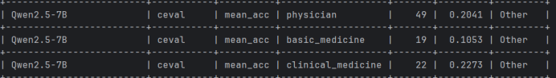
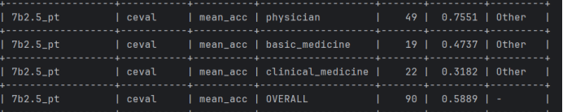
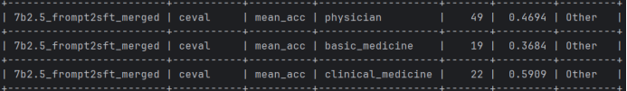
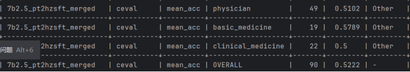
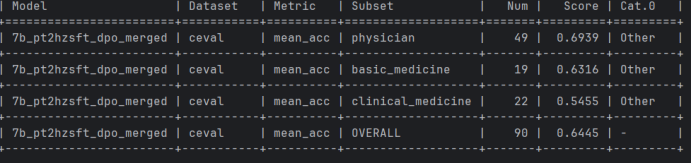

[**🇨🇳中文**](https://github.com/shibing624/MedicalGPT/blob/main/README.md) | [**🌐English**](https://github.com/shibing624/MedicalGPT/blob/main/README_EN.md) | [**📖文档/Docs**](https://github.com/shibing624/MedicalGPT/wiki) | [**🤖模型/Models**](https://huggingface.co/shibing624)

<div align="center">
  <a href="https://github.com/shibing624/MedicalGPT">
    
  </a>
</div>

-----------------

# MedicalGPT: Training Medical GPT Model
[](https://huggingface.co/shibing624)
[](https://star-history.com/#shibing624/MedicalGPT&Timeline)
[](CONTRIBUTING.md)
[](LICENSE)
[](requirements.txt)
[](https://github.com/shibing624/MedicalGPT/issues)
[](#Contact)

## 📖 Introduction

**MedicalGPT** training medical GPT model with ChatGPT training pipeline, implemantation of Pretraining,
Supervised Finetuning, RLHF(Reward Modeling and Reinforcement Learning) and DPO(Direct Preference Optimization).

**MedicalGPT** 训练医疗大模型，实现了包括增量预训练、有监督微调、RLHF(奖励建模、强化学习训练)和DPO(直接偏好优化)。


- RLHF training pipeline来自Andrej Karpathy的演讲PDF [State of GPT](https://karpathy.ai/stateofgpt.pdf)，视频 [Video](https://build.microsoft.com/en-US/sessions/db3f4859-cd30-4445-a0cd-553c3304f8e2)
- DPO方法来自论文[Direct Preference Optimization:Your Language Model is Secretly a Reward Model](https://arxiv.org/pdf/2305.18290.pdf)
- ORPO方法来自论文[ORPO: Monolithic Preference Optimization without Reference Model](https://arxiv.org/abs/2403.07691)

个人自主学习medicalgpt，原仓库参考：https://github.com/shibing624/MedicalGPT

<details><summary>展开日志</summary>


</details>


## 😊 Features


基于ChatGPT Training Pipeline，本项目实现了领域模型--医疗行业语言大模型的训练：


- 第一阶段：PT(Continue PreTraining)增量预训练，在海量领域文档数据上二次预训练GPT模型，以适应领域数据分布（可选）
- 第二阶段：SFT(Supervised Fine-tuning)有监督微调，构造指令微调数据集，在预训练模型基础上做指令精调，以对齐指令意图，并注入领域知识
- 第三阶段
  - RLHF(Reinforcement Learning from Human Feedback)基于人类反馈对语言模型进行强化学习，分为两步：
    - RM(Reward Model)奖励模型建模，构造人类偏好排序数据集，训练奖励模型，用来建模人类偏好，主要是"HHH"原则，具体是"helpful, honest, harmless"
    - RL(Reinforcement Learning)强化学习，用奖励模型来训练SFT模型，生成模型使用奖励或惩罚来更新其策略，以便生成更高质量、更符合人类偏好的文本
  - [DPO(Direct Preference Optimization)](https://arxiv.org/pdf/2305.18290.pdf)直接偏好优化方法，DPO通过直接优化语言模型来实现对其行为的精确控制，而无需使用复杂的强化学习，也可以有效学习到人类偏好，DPO相较于RLHF更容易实现且易于训练，效果更好
  - [ORPO](https://arxiv.org/abs/2403.07691)比值比偏好优化，不需要参考模型（ref_model）的优化方法，通过ORPO，LLM可以同时学习SFT和对齐，将两个过程整合为单一步骤，缓解模型灾难性遗忘问题

## 📊 实验结果

基于Qwen2.5-7B模型的医疗领域大模型训练实验，主要工作：
主要工作：1.PT增量预训练：在shibing624/medical的领域预训练数据上二次预训练模型，以适应领域数据分布。在evalscope评测框架中ceval的basic_medicine子集评测，由基础模型的0.1053得分上升到0.4737
2.SFT有监督微调：在预训练基础上使用medical里的194w中文数据集做微调，SFT之后在ceval的相关领域子集上面测试，发现模型的得分并没有提升，反而出现下降，从0.4737下降到0.3684。针对微调模型后在ceval医疗指标上成绩会下降的问题。先把原始语料（194w数据）和目标数据ceval医疗子集题目向量化，每条语料找top-50个相关题目，计算平均向量相似度，选出相似度最高的2w条语料作为新的微调数据集。ceval的basic_medicine子集评测分数和最初的SFT和PT相比均有所提升，提升到0.5789
3.RL:采用DPO算法训练，基于PT与SFT后模型进行DPO 偏好对齐与训练：
初步使用medical/reward 3800条纯医学偏好数据训练，发现模型存在领域过拟合、偏好信号单一问题。于是引入通用对话偏好数据与医学数据混合训练，构建领域 + 通用混合偏好数据集进行DPO训练，实验证明混合偏好训练可有效提升模型对齐效果，对比SFT后模型，经过DPO后的模型在ceval的basic_medicine子集评测分数上从0.5789提升到0.6316。回答的准确性、逻辑性与专家偏好一致性均得到明显改善。
使用evalscope在ceval的basic_medicine子集上评测：

| 训练阶段 | 分数 | 提升说明 |
|:---------|:-----|:---------|
| 基础模型 | 0.1053 | - |
| 增量预训练(PT) | 0.4737 | +350% 领域适应 |
| 原始SFT | 0.3684 | 过拟合导致下降 |
| 优化SFT | 0.5789 | 通过数据筛选提升 |
| DPO偏好对齐 | 0.6316 | +9% 对齐效果 |

评测数据：
基础模型baseline:


增量预训练：


原始SFT：


优化SFT：


DPO：


**实验关键发现：**
- **增量预训练效果显著**：在医学预训练数据上继续训练，使模型从0.1053提升到0.4737
- **SFT数据选择至关重要**：原始194万数据直接SFT导致过拟合，通过向量相似度筛选出2万条高相关数据，效果反而更好
- **DPO混合偏好训练**：纯医学偏好数据导致领域过拟合，混合通用对话数据后模型回答的准确性、逻辑性与专家偏好一致性均得到明显改善


## 💾 Install
#### Updating the requirements
`requirements.txt`会不时更新以适配最新功能，使用以下命令更新依赖:

```markdown
git clone https://github.com/shibing624/MedicalGPT
cd MedicalGPT
pip install -r requirements.txt --upgrade
```

#### Hardware Requirement (显存/VRAM)


\* *估算值*

| 训练方法  | 精度          |   7B  |  13B  |  30B  |   70B  |  110B  |  8x7B |  8x22B |
|-------|-------------| ----- | ----- | ----- | ------ | ------ | ----- | ------ |
| 全参数   | AMP(自动混合精度) | 120GB | 240GB | 600GB | 1200GB | 2000GB | 900GB | 2400GB |
| 全参数   | 16          |  60GB | 120GB | 300GB |  600GB |  900GB | 400GB | 1200GB |
| LoRA  | 16          |  16GB |  32GB |  64GB |  160GB |  240GB | 120GB |  320GB |
| QLoRA | 8           |  10GB |  20GB |  40GB |   80GB |  140GB |  60GB |  160GB |
| QLoRA | 4           |   6GB |  12GB |  24GB |   48GB |   72GB |  30GB |   96GB |
| QLoRA | 2           |   4GB |   8GB |  16GB |   24GB |   48GB |  18GB |   48GB |

## 🚀 Training Pipeline

Training Stage:

| Stage                          | Introduction | Python script                                                                                           | Shell script                                                                  |
|:-------------------------------|:-------------|:--------------------------------------------------------------------------------------------------------|:------------------------------------------------------------------------------|
| Continue Pretraining           | 增量预训练        | [pretraining.py](https://github.com/shibing624/MedicalGPT/blob/main/pretraining.py)                     | [run_pt.sh](https://github.com/shibing624/MedicalGPT/blob/main/run_pt.sh)     |
| Supervised Fine-tuning         | 有监督微调        | [supervised_finetuning.py](https://github.com/shibing624/MedicalGPT/blob/main/supervised_finetuning.py) | [run_sft.sh](https://github.com/shibing624/MedicalGPT/blob/main/run_sft.sh)   |
| Direct Preference Optimization | 直接偏好优化       | [dpo_training.py](https://github.com/shibing624/MedicalGPT/blob/main/dpo_training.py)                   | [run_dpo.sh](https://github.com/shibing624/MedicalGPT/blob/main/run_dpo.sh)   |
| Reward Modeling                | 奖励模型建模       | [reward_modeling.py](https://github.com/shibing624/MedicalGPT/blob/main/reward_modeling.py)             | [run_rm.sh](https://github.com/shibing624/MedicalGPT/blob/main/run_rm.sh)     |
| Reinforcement Learning         | 强化学习         | [ppo_training.py](https://github.com/shibing624/MedicalGPT/blob/main/ppo_training.py)                   | [run_ppo.sh](https://github.com/shibing624/MedicalGPT/blob/main/run_ppo.sh)   |
| ORPO                           | 概率偏好优化       | [orpo_training.py](https://github.com/shibing624/MedicalGPT/blob/main/orpo_training.py)                  | [run_orpo.sh](https://github.com/shibing624/MedicalGPT/blob/main/run_orpo.sh) |

- 提供完整PT+SFT+DPO全阶段串起来训练的pipeline：[run_training_dpo_pipeline.ipynb](https://github.com/shibing624/MedicalGPT/blob/main/run_training_dpo_pipeline.ipynb) ，其对应的colab： [](https://colab.research.google.com/github/shibing624/MedicalGPT/blob/main/run_training_dpo_pipeline.ipynb)，运行完大概需要15分钟
- 提供完整PT+SFT+RLHF全阶段串起来训练的pipeline：[run_training_ppo_pipeline.ipynb](https://github.com/shibing624/MedicalGPT/blob/main/run_training_ppo_pipeline.ipynb) ，其对应的colab： [](https://colab.research.google.com/github/shibing624/MedicalGPT/blob/main/run_training_ppo_pipeline.ipynb) ，运行完大概需要20分钟
- 提供基于知识库文件的LLM问答功能（RAG）：[chatpdf.py](https://github.com/shibing624/MedicalGPT/blob/main/chatpdf.py)
- [训练参数说明](https://github.com/shibing624/MedicalGPT/blob/main/docs/training_params.md) | [训练参数说明wiki](https://github.com/shibing624/MedicalGPT/wiki/%E8%AE%AD%E7%BB%83%E5%8F%82%E6%95%B0%E8%AF%B4%E6%98%8E)
- [数据集](https://github.com/shibing624/MedicalGPT/blob/main/docs/datasets.md) | [数据集wiki](https://github.com/shibing624/MedicalGPT/wiki/%E6%95%B0%E6%8D%AE%E9%9B%86)
- [扩充词表](https://github.com/shibing624/MedicalGPT/blob/main/docs/extend_vocab.md) | [扩充词表wiki](https://github.com/shibing624/MedicalGPT/wiki/%E6%89%A9%E5%85%85%E4%B8%AD%E6%96%87%E8%AF%8D%E8%A1%A8)
- [FAQ](https://github.com/shibing624/MedicalGPT/blob/main/docs/FAQ.md) | [FAQ_wiki](https://github.com/shibing624/MedicalGPT/wiki/FAQ)

#### Supported Models

| Model Name                                                           | Model Size                    | Target Modules  | Template  |
|----------------------------------------------------------------------|-------------------------------|-----------------|-----------|
| [Baichuan](https://github.com/baichuan-inc/baichuan-13B)             | 7B/13B                        | W_pack          | baichuan  |
| [Baichuan2](https://github.com/baichuan-inc/Baichuan2)               | 7B/13B                        | W_pack          | baichuan2 |
| [BLOOMZ](https://huggingface.co/bigscience/bloomz)                   | 560M/1.1B/1.7B/3B/7.1B/176B   | query_key_value | vicuna    |
| [ChatGLM](https://github.com/THUDM/ChatGLM-6B)                       | 6B                            | query_key_value | chatglm   |
| [ChatGLM2](https://github.com/THUDM/ChatGLM2-6B)                     | 6B                            | query_key_value | chatglm2  |
| [ChatGLM3](https://github.com/THUDM/ChatGLM3)                        | 6B                            | query_key_value | chatglm3  |
| [Cohere](https://huggingface.co/CohereForAI/c4ai-command-r-plus)     | 104B                          | q_proj,v_proj   | cohere    |
| [DeepSeek](https://github.com/deepseek-ai/DeepSeek-LLM)              | 7B/16B/67B                    | q_proj,v_proj   | deepseek  |
| [DeepSeek3](https://github.com/deepseek-ai/DeepSeek-V3)              | 671B                         | q_proj,v_proj   | deepseek3 |
| [InternLM2](https://github.com/InternLM/InternLM)                    | 7B/20B                        | wqkv            | intern2   |
| [LLaMA](https://github.com/facebookresearch/llama)                   | 7B/13B/33B/65B                | q_proj,v_proj   | alpaca    |
| [LLaMA2](https://huggingface.co/meta-llama)                          | 7B/13B/70B                    | q_proj,v_proj   | llama2    |
| [LLaMA3](https://huggingface.co/meta-llama)                          | 8B/70B                        | q_proj,v_proj   | llama3    |
| [Mistral](https://huggingface.co/mistralai/Mistral-7B-Instruct-v0.1) | 7B/8x7B                       | q_proj,v_proj   | mistral   |
| [Orion](https://github.com/OrionStarAI/Orion)                        | 14B                           | q_proj,v_proj   | orion     |
| [Qwen](https://github.com/QwenLM/Qwen)                               | 1.8B/7B/14B/72B               | c_attn          | qwen      |
| [Qwen1.5](https://huggingface.co/Qwen/Qwen1.5-72B)                   | 0.5B/1.8B/4B/14B/32B/72B/110B | q_proj,v_proj   | qwen      |
| [Qwen2](https://github.com/QwenLM/Qwen2)                             | 0.5B/1.5B/7B/72B              | q_proj,v_proj   | qwen      |
| [Qwen2.5](https://github.com/QwenLM/Qwen2.5)                         | 0.5B/1.8B/4B/14B/72B        | q_proj,v_proj   | qwen      |
| [XVERSE](https://github.com/xverse-ai/XVERSE-13B)                    | 13B                           | query_key_value | xverse    |
| [Yi](https://github.com/01-ai/Yi)                                    | 6B/34B                        | q_proj,v_proj   | yi        |


## 💻 Inference
训练完成后，现在我们加载训练好的模型，验证模型生成文本的效果。

```shell
CUDA_VISIBLE_DEVICES=0 python inference.py \
    --base_model path_to_model_hf_dir \
    --lora_model path_to_lora \
    --interactive
```

参数说明：

- `--base_model {base_model}`：存放HF格式的LLaMA模型权重和配置文件的目录
- `--tokenizer_path {base_model}`：存放HF格式的LLaMA模型权重和配置文件的目录
- `--lora_model {lora_model}`：LoRA解压后文件所在目录，也可使用HF Model Hub模型调用名称。如果已经合并了LoRA权重到预训练模型，则可以不提供此参数
- `--tokenizer_path {tokenizer_path}`：存放对应tokenizer的目录。若不提供此参数，则其默认值与--base_model相同
- `--template_name`：模板名称，如`vicuna`、`alpaca`等。若不提供此参数，则其默认值是vicuna
- `--interactive`：以交互方式启动多轮问答，使用流式推理
- `--data_file {file_name}`：非交互方式启动下，读取file_name中的的内容进行batch预测
- `--output_file {file_name}`：非交互式方式下，将预测的结果以jsonl格式写入file_name
- `--resize_emb`：是否调整embedding大小，若不调整，则使用预训练模型的embedding大小，默认不调整
- `--only_cpu`：仅使用CPU进行推理
- `--gpus {gpu_ids}`：指定使用的GPU设备编号，默认为0。如使用多张GPU，以逗号分隔，如0,1,2

#### 多卡推理
多卡数据并行，batch推理
```shell
CUDA_VISIBLE_DEVICES=0,1 torchrun --nproc_per_node 2 inference_multigpu_demo.py --base_model shibing624/vicuna-baichuan-13b-chat
```
#### vllm多卡部署
```shell
sh vllm_deployment.sh
```

## 📚 Dataset
### 医疗数据集

- 240万条中文医疗数据集(包括预训练、指令微调和奖励数据集)：[shibing624/medical](https://huggingface.co/datasets/shibing624/medical)
- 22万条中文医疗对话数据集(华佗项目)：[shibing624/huatuo_medical_qa_sharegpt](https://huggingface.co/datasets/shibing624/huatuo_medical_qa_sharegpt) 【本项目支持格式】

### 通用数据集

#### Pretraining datasets(预训练数据集)
- 16GB中英文无监督、平行语料[Linly-AI/Chinese-pretraining-dataset](https://huggingface.co/datasets/Linly-AI/Chinese-pretraining-dataset)
- 524MB中文维基百科语料[wikipedia-cn-20230720-filtered](https://huggingface.co/datasets/pleisto/wikipedia-cn-20230720-filtered)
#### Supervised fine-tuning datasets(指令微调数据集)
- 10万条多语言ShareGPT GPT4多轮对话数据集：[shibing624/sharegpt_gpt4](https://huggingface.co/datasets/shibing624/sharegpt_gpt4) 【本项目支持格式】
- 9万条英文ShareGPT多轮对话数集：[anon8231489123/ShareGPT_Vicuna_unfiltered](https://huggingface.co/datasets/anon8231489123/ShareGPT_Vicuna_unfiltered) 【本项目支持格式】
- 50万条中文ChatGPT指令Belle数据集：[BelleGroup/train_0.5M_CN](https://huggingface.co/datasets/BelleGroup/train_0.5M_CN)
- 100万条中文ChatGPT指令Belle数据集：[BelleGroup/train_1M_CN](https://huggingface.co/datasets/BelleGroup/train_1M_CN)
- 5万条英文ChatGPT指令Alpaca数据集：[50k English Stanford Alpaca dataset](https://github.com/tatsu-lab/stanford_alpaca#data-release)
- 2万条中文ChatGPT指令Alpaca数据集：[shibing624/alpaca-zh](https://huggingface.co/datasets/shibing624/alpaca-zh)
- 69万条中文指令Guanaco数据集(Belle50万条+Guanaco19万条)：[Chinese-Vicuna/guanaco_belle_merge_v1.0](https://huggingface.co/datasets/Chinese-Vicuna/guanaco_belle_merge_v1.0)
- 5万条英文ChatGPT多轮对话数据集：[RyokoAI/ShareGPT52K](https://huggingface.co/datasets/RyokoAI/ShareGPT52K)
- 80万条中文ChatGPT多轮对话数据集：[BelleGroup/multiturn_chat_0.8M](https://huggingface.co/datasets/BelleGroup/multiturn_chat_0.8M)
- 116万条中文ChatGPT多轮对话数据集：[fnlp/moss-002-sft-data](https://huggingface.co/datasets/fnlp/moss-002-sft-data)
- 3.8万条中文ShareGPT多轮对话数据集：[FreedomIntelligence/ShareGPT-CN](https://huggingface.co/datasets/FreedomIntelligence/ShareGPT-CN)
- 130万条中文微调数据集（汇总）：[zhuangxialie/Llama3-Chinese-Dataset](https://modelscope.cn/datasets/zhuangxialie/Llama3-Chinese-Dataset/dataPeview) 【本项目支持格式】
- 7千条中文角色扮演多轮对话数据集：[shibing624/roleplay-zh-sharegpt-gpt4-data](https://huggingface.co/datasets/shibing624/roleplay-zh-sharegpt-gpt4-data) 【本项目支持格式】

#### Preference datasets(偏好数据集)
- 2万条中英文偏好数据集：[shibing624/DPO-En-Zh-20k-Preference](https://huggingface.co/datasets/shibing624/DPO-En-Zh-20k-Preference) 【本项目支持格式】
- 原版的oasst1数据集：[OpenAssistant/oasst1](https://huggingface.co/datasets/OpenAssistant/oasst1)
- 2万条多语言oasst1的reward数据集：[tasksource/oasst1_pairwise_rlhf_reward](https://huggingface.co/datasets/tasksource/oasst1_pairwise_rlhf_reward)
- 11万条英文hh-rlhf的reward数据集：[Dahoas/full-hh-rlhf](https://huggingface.co/datasets/Dahoas/full-hh-rlhf)
- 9万条英文reward数据集(来自Anthropic's Helpful Harmless dataset)：[Dahoas/static-hh](https://huggingface.co/datasets/Dahoas/static-hh)
- 7万条英文reward数据集（来源同上）：[Dahoas/rm-static](https://huggingface.co/datasets/Dahoas/rm-static)
- 7万条繁体中文的reward数据集（翻译自rm-static）[liswei/rm-static-m2m100-zh](https://huggingface.co/datasets/liswei/rm-static-m2m100-zh)
- 7万条英文Reward数据集：[yitingxie/rlhf-reward-datasets](https://huggingface.co/datasets/yitingxie/rlhf-reward-datasets)
- 3千条中文知乎问答偏好数据集：[liyucheng/zhihu_rlhf_3k](https://huggingface.co/datasets/liyucheng/zhihu_rlhf_3k)


## 💕 Acknowledgements

- [Direct Preference Optimization:Your Language Model is Secretly a Reward Model](https://arxiv.org/pdf/2305.18290.pdf)
- [tloen/alpaca-lora](https://github.com/tloen/alpaca-lora/blob/main/finetune.py)
- [ymcui/Chinese-LLaMA-Alpaca](https://github.com/ymcui/Chinese-LLaMA-Alpaca)
- [hiyouga/LLaMA-Factory](https://github.com/hiyouga/LLaMA-Factory)
- [dvlab-research/LongLoRA](https://github.com/dvlab-research/LongLoRA)

Thanks for their great work!


